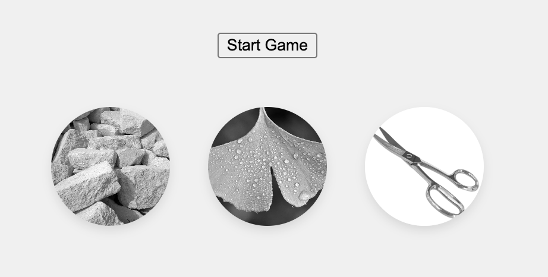
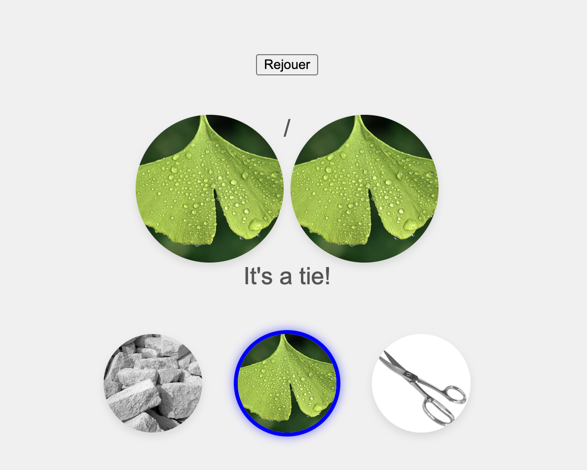

# Pierre-Feuille-Ciseaux en React

Un jeu classique de Pierre-Feuille-Ciseaux développé avec React et TypeScript. Ce projet est conçu pour être simple.

 <!-- Remplace par une capture d'écran réelle si possible -->
 <!-- Remplace par une capture d'écran réelle si possible -->

## Fonctionnalités

- **Choix utilisateur** : Sélectionne entre Pierre, Feuille ou Ciseaux.
- **Choix de l'ordinateur** : L'ordinateur choisit aléatoirement.
- **Décompte** : Un décompte de 3 secondes avant de révéler les choix.
- **Résultat** : Affiche le résultat de la partie (Gagné, Perdu ou Égalité).
- **Rejouer** : Un bouton "Rejouer" pour recommencer une nouvelle partie.


## Installation

Suis ces étapes pour installer et exécuter le projet localement.

### Prérequis

- Node.js (version 16 ou supérieure)
- npm (gestionnaire de paquets Node.js)

### Étapes

1. Clone le dépôt :

   ```bash
   git clone https://github.com/ton-utilisateur/pierre-feuille-ciseaux-react.git
   ```

2. Accède au dossier du projet :

   ```bash
   cd pierre-feuille-ciseaux-react
   ```

3. Installe les dépendances :

   ```bash
   npm install
   ```

4. Lance l'application en mode développement :

   ```bash
   npm start
   ```

5. Ouvre ton navigateur et accède à :

   ```
   http://localhost:3000
   ```

## Utilisation

1. Clique sur **Start Game** pour commencer une nouvelle partie.
2. Sélectionne Pierre, Feuille ou Ciseaux avant la fin du décompte.
3. Le résultat de la partie sera affiché après le décompte.
4. Clique sur **Rejouer** pour recommencer une nouvelle partie.

## Licence

Ce projet est sous licence MIT. Voir le fichier [LICENSE](LICENSE) pour plus de détails.

---

## Auteur

- **Leo D * - [Ton GitHub](https://github.com/LeoD-h)

---
